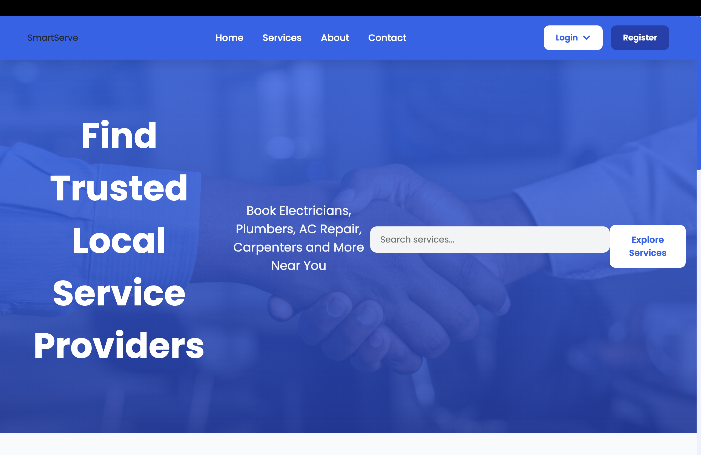
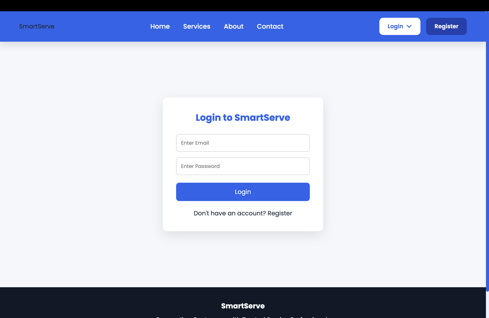
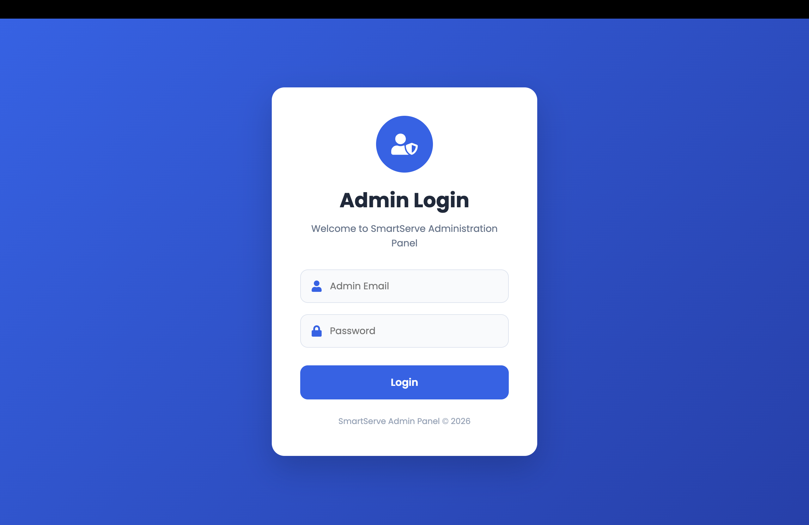
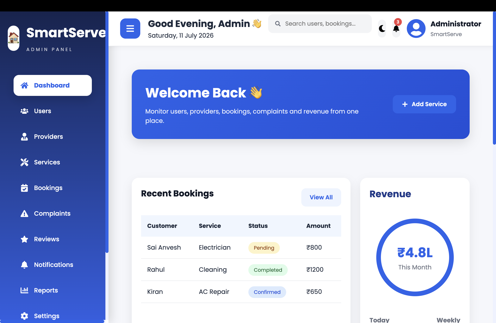

# 🚀 SmartServe


# MERN-Based Local Service Booking Platform

SmartServe is a full-stack MERN (MongoDB, Express.js, React.js, Node.js) application that connects customers with trusted local service providers. Users can browse services, book appointments, manage bookings, and track service status, while providers and administrators manage services and platform operations through dedicated dashboards.

---

# 📖 Table of Contents

- Overview
- Features
- Tech Stack
- Project Structure
- Installation
- Environment Variables
- API Modules
- Screenshots
- Future Enhancements
- Developer

---

# 📌 Overview

SmartServe simplifies local service booking by connecting customers with trusted professionals.

Supported services include:

- ⚡ Electricians
- 🚰 Plumbers
- 🪚 Carpenters
- ❄️ AC Technicians
- 🧹 Cleaners
- 🎨 Painters
- 🔧 Home Maintenance Services

The application supports three types of users:

- 👤 Customer
- 👨‍🔧 Service Provider
- 👨‍💼 Administrator

---

# ✨ Features

## 👤 Customer

- User Registration & Login
- Secure JWT Authentication
- Browse Services
- Search & Filter Services
- View Service Details
- Book Services
- Booking History
- Booking Status Tracking
- Wishlist
- Reviews & Ratings
- Complaint Management
- Notifications
- Profile Management

---

## 👨‍🔧 Service Provider

- Provider Dashboard
- Manage Services
- View Bookings
- Update Booking Status
- Provider Profile Management

---

## 👨‍💼 Administrator

- Admin Dashboard
- Manage Users
- Manage Providers
- Manage Services
- Manage Bookings
- Complaint Management
- Revenue Analytics

---

# 🛠 Tech Stack

## Frontend

- React.js
- Vite
- React Router DOM
- Axios
- Framer Motion
- React Toastify
- React Icons
- Chart.js
- Recharts
- Swiper
- React Datepicker
- Lottie React

---

## Backend

- Node.js
- Express.js
- MongoDB
- Mongoose
- JWT Authentication
- bcryptjs
- dotenv
- CORS

---

## Database

- MongoDB (Local Database)

## Database Tool

- MongoDB Compass

---

# 📦 Major Modules

- Authentication
- User Management
- Provider Management
- Admin Dashboard
- Service Management
- Booking Management
- Booking Tracking
- Wishlist
- Reviews & Ratings
- Complaint Management
- Notification System
- Revenue Dashboard

---

# 📂 Project Structure

```text
SmartServe
│
├── backend
│   ├── config
│   ├── middleware
│   ├── models
│   ├── routes
│   ├── uploads
│   ├── utils
│   ├── app.js
│   ├── server.js
│   └── package.json
│
├── frontend
│   ├── public
│   ├── src
│   │
│   ├── assets
│   ├── components
│   ├── context
│   ├── pages
│   ├── services
│   ├── styles
│   ├── App.jsx
│   └── main.jsx
│
├── screenshots
│
├── README.md
├── package.json
└── .gitignore
```

---

# ⚙️ Installation

## Clone Repository

```bash
git clone https://github.com/saianvesh2005/SmartServe.git
```

## Navigate to Project

```bash
cd SmartServe
```

## Install Backend Dependencies

```bash
cd backend

npm install

npm run dev
```

## Install Frontend Dependencies

```bash
cd ../frontend

npm install

npm run dev
```

---

# 🔐 Environment Variables

Create a `.env` file inside the **backend** folder.

```env
PORT=5000

MONGO_URI=mongodb://127.0.0.1:27017/smartserve

JWT_SECRET=your_secret_key

CLOUDINARY_CLOUD_NAME=your_cloud_name

CLOUDINARY_API_KEY=your_api_key

CLOUDINARY_API_SECRET=your_api_secret
```

---

# 📡 Backend API Modules

- Authentication APIs
- User APIs
- Provider APIs
- Service APIs
- Booking APIs
- Wishlist APIs
- Review APIs
- Complaint APIs
- Notification APIs
- Admin APIs

---

# 📸 Screenshots

## 🏠 Home Page



---

## 👤 User Login



---

## 👨‍💼 Admin Login



---

## 🛠 Services


---

## 📅 Booking Confirmation

> Replace the filename below if your image has a different name.


---

## 👨‍💼 Admin Dashboard



---

## 📊 Revenue Dashboard


---

# 🚀 Future Enhancements

- Online Payment Gateway
- Live Chat
- Google Maps Integration
- Email Notifications
- SMS Notifications
- AI-Based Service Recommendation
- Invoice Generation
- Coupons & Offers
- Mobile Application
- Multi-language Support

---

# 👨‍💻 Developer

## Sai Anvesh Reddy

**B.Tech – Computer Science & Engineering**

GitHub:

https://github.com/saianvesh2005

---

# 📄 License

This project is developed for educational and learning purposes.

---

# ⭐ Show Your Support

If you found this project helpful, please consider giving it a ⭐ on GitHub.

It motivates further development and future enhancements.

---

# 💡 SmartServe

### **Making Local Service Booking Simple, Fast, and Reliable.**